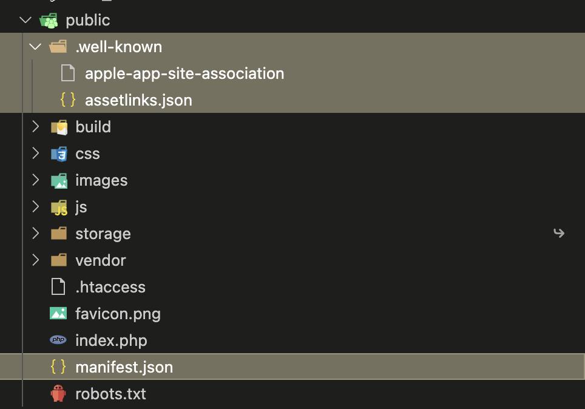

# Usage

This package allows you to add the following features to your Laravel application:

* Show [smart banners](usage.md#adding-smart-banner) to users when navigating using a mobile device (Apple only for now).
* Universal links (Apple only) which uses the current page path (URL) to continue navigation through the application when smart banner is used (**meta tag must be injected to the HTML header**)
* [App links](usage.md#redirect-users-to-mobile-apps) which lets you **redirect users from your Laravel app to any native application** installed on the user device or, optionally, **to the store if none was found**.
* [Show app stores badge images with links](usage.md#getting-store-banner-html) to your registered applications.
* [Generate app links verification files](usage.md#generate-files) and [web app manifest](https://developer.mozilla.org/en-US/docs/Web/Manifest).

## Generate files


This is required to be able to use App links on your mobile applications but there is some extra steps that you should make on them.

[Deep links documentation page for Android](https://developer.android.com/training/app-links/deep-linking).

[Universal Links documentation page for Apple](https://developer.apple.com/documentation/xcode/supporting-universal-links-in-your-app).


If you need to verify app links on your native mobile applications (iOS, Android) this package allows you to do that in a interactive way with this artisan command:

```bash
php artisan app:companion:generate
```

This command will ask some questions like list of SHA2 certificate fingerprints (if you registered any Android app) and site paths associated to the Apple applications (if you registered any).

And at the end will ask for generate a manifest.json for your Laravel web app which will recommend the user to any of the applications registered whenever the devices matches a criteria. [Learn more here](https://developer.mozilla.org/en-US/docs/Web/Manifest/related\_applications).

At the end you should have the following files on your public folder (this also configurable through `config/companion.php`):

<figure><figcaption></figcaption></figure>

## Redirect users to mobile apps

With the previous step generating the files required for your applications to be verified you can now redirect users from your website to these mobile apps if they have them installed.

```php
<?php

namespace App\Http\Controllers;

use App\Models\User;
use Illuminate\Http\RedirectResponse;

class UserController extends Controller
{
    public function show(User $user): RedirectResponse
    {
        return redirect()->toApp(Companion::android('com.example'), "users/{$user->id}");
    }
}
```

You can also add a fallback to these redirects in case the user does not have any application installed:

```php
<?php

namespace App\Http\Controllers;

use App\Models\User;
use Illuminate\Http\RedirectResponse;

class UserController extends Controller
{
    public function show(User $user): RedirectResponse
    {
        return redirect()->toApp(
            Companion::android('com.example'),
            "users/{$user->id}",
            'https://my_laravel_app.com/our_apps'
        );
    }
}
```

## Adding smart banner

<figure><figcaption><p>An iOS device showing the smart banner from Safari navigating into a website</p></figcaption></figure>

To show to Apple devices users a banner like the one shown whenever they're navigating in your Laravel application you have the following Blade directive:

```php
@companionMetaTags
```

You also have the method if you're not using Blade:

```php
use OpenSoutheners\LaravelCompanionApps\Support\Facades\Companion;

app('companion')->metaTags();

// or

Companion::metaTags();
```


Is recommended that you add this to the `<head>` part of your application otherwise it might now work.


## Getting store banner HTML

You also can show application banner images like the following example using Blade:

```php
{!! app('companion')->android('com.example')->getStoreBadgeHtml(); !!}
{!! app('companion')->apple('com.example')->getStoreBadgeHtml(); !!}
```

If you want to customise its size or alt on the rendered img HTML tag you can pass the following to the arguments:

```php
{!! app('companion')->android('com.example')->getStoreBadgeHtml(width: 240, alt: 'download_my_app'); !!}
```

### Localise the banner image

**By default this package only translates automatically the Android badge,** for the Apple apps you might need to replace the `companion.php` option `store.apple_badge_url`:

```php
/**
 * Apple App Store badge url where you host it as Android host its own badges.
 * 
 * You can officially download them from here:
 * https://developer.apple.com/app-store/marketing/guidelines/
 * 
 * Add {region} in case you want to manage multiple badges across multiple regions (locales).
 * 
 * Static badge url: asset('app_store_badge.svg')
 * Using Laravel helper functions: asset('app_store/{region}/black_badge.svg')
 * Or just a string as external img: https://cdn.my_host.com/app_store/{region}/black_badge.svg
 */
 'apple_badge_url' => asset('app_store/{region}/black_badge.svg'),
```

The example above will output the following image whenever a user from Spain visits your website where you show the App Store badges:

```html

```
